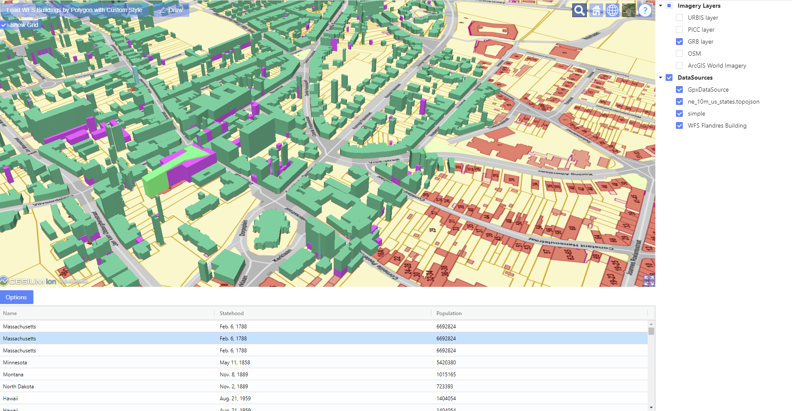
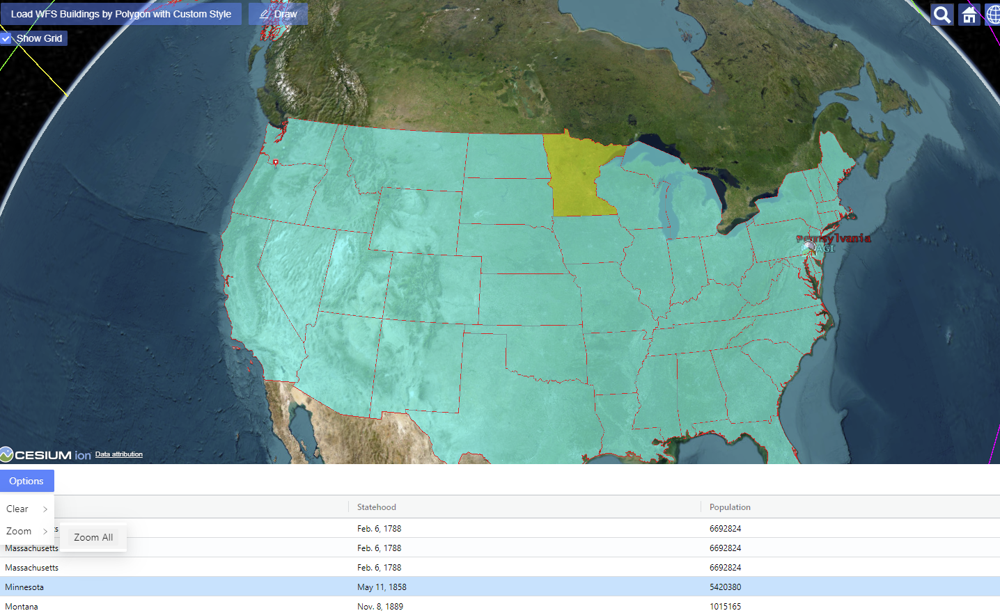
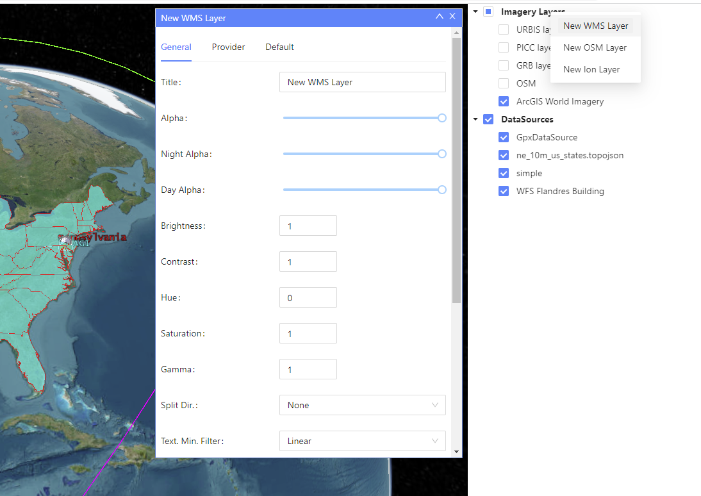
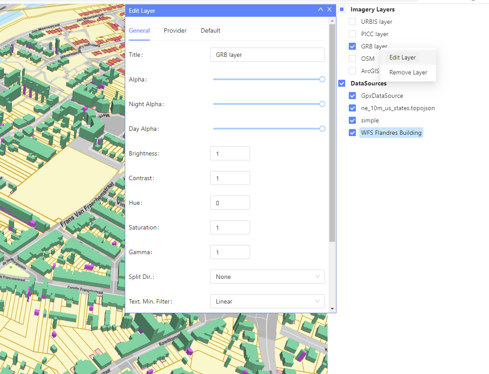
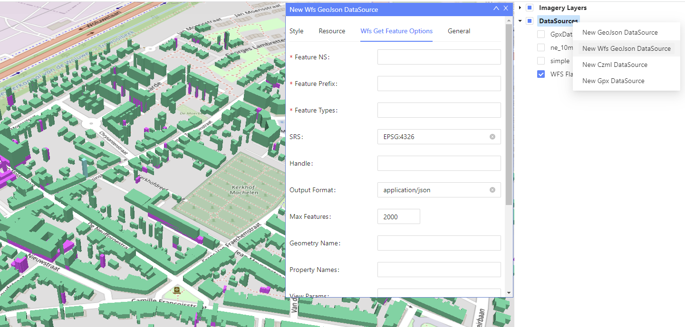
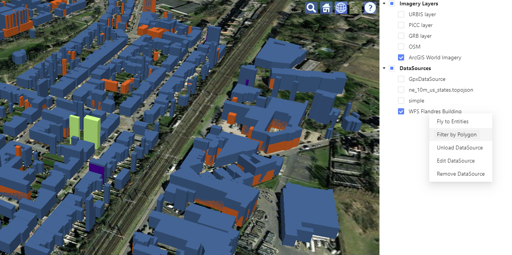
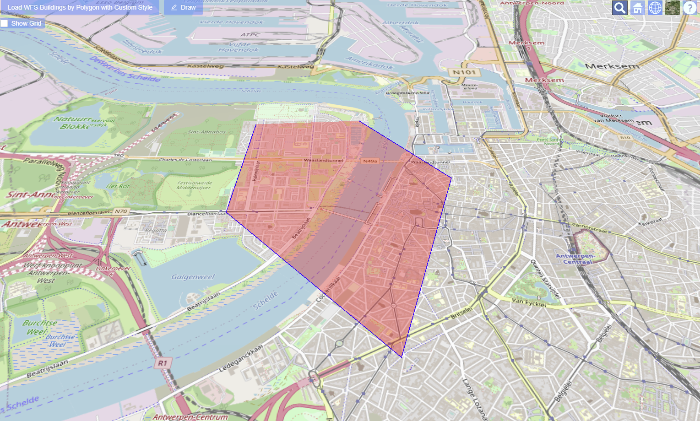
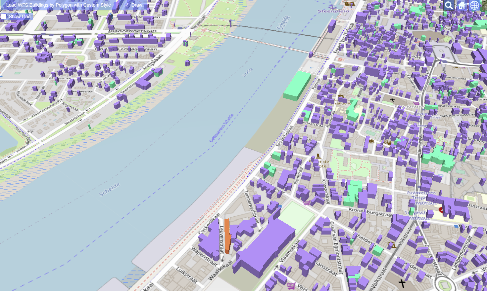

## 1-About

React-CesiumExt, the React Cesium Extension, is a Open Source Toolkit that provides collection of components to build a professional 3D map application. Its implementation is based on [Cesium](https://cesium.com/), [OpenLayers](https://openlayers.org/), [Ant Design](https://ant.design) and [React](https://reactjs.org) library. 
With a few lines of code you will be able to create a powerfull 3D Web Map application.

So, React-CesiumExt provide you the power to launch a professional 3D Web Map application using Cesium with support to OGC standards like WMS and WFS, givining
you the ready to use UI components to:
- Add WMS layers
- Create WMS Layers on-the-fly
- Add WFS Layers
- Create WFS layers on-the-fly
- Search features using WFS spatial queries
- Visualize and result of the search in the Cesium Viewer and the list of features in a Grid component.
- Etc...

React-CesiumExt is under the MIT License, which allow you to develop open-source or commercial applications 
free of charge. 
The source code is available at [Github](https://github.com/mapuiexts/React-CesiumExt).

React-CesiumExt 0.1.x is the first base version which uses currently the versions Cesiumjs and React;

## 2-UI Components
As shown in the figure below, some included components are: __Imagery Layer Tree__, __DataSource Tree__, __Entity Grid__, etc.
There are a lot of UI components ready to be used or to be extended. For the complete list and description of all components, check the section "UI Components"
on this documentation: there you can also find the usage of each component with description of the parameters and a LIVE EDITOR on where you can modify the code and see interactively the result.

### 2.1-Entity Grid
You can add in your application an __Entity Grid__ component to visualize the list of entities from a specified datasource.
This Grid component is dynamic. It means that:
- If the attribute properties of a entity is changed, the changes will be reflected in the grid.
- Also if new entities are added to the datasource or removed from it, the new entities will be added or removed automatically.

Once you select a row in the grid, the entity will be highlighted with the configured color. In the figure below, the selected row (Minnesota) in showning
in the Cesium Viewer with a highlighted yellow color.

Also it is included in the grid the button "options" with the common options to zoom to the entities and clear the datasource. New options will be available soon.

### 2.2- WFS Entity Grid
The development for the WFS Entity Grid is still in progress and it will be released soon.
The following functionalities will be included:
- Build complexes queries using several OGC operators: Equal To, Like, Greater Than, Less Than, etc.
- Build complexes queries using OGC spatial operators: Filter by Polygon, Bounding Box, etc.
- The Grid column names are automatically retrieved from WFS query
- Highlight in the map the selected entity in Grid (selection of multiple rows are possible)
- Zoom in the map to the selected entity(ies) in the Grid or Zoom to all retrieved entities
- Clear in the map the selected entity(ies) in the Grid or clear all the retrieved entities
- Etc.

### 2.3- Imagery Layer Tree View
The Tree Layer will allow the user to show/hide the configured imagery layers in the map. Additionally, this UI component provides
a powerfull context menu once the user right clicks in the tree node. The context menu will provide several options.
This context menu also can be customized with new options or to remove some of them.

If the user right click in the root node, the following functionalities are available to create a new layer:
- Create a New WMS Layer
- Create a New OSM Layer
- Create a Ion Layer
- Remark: possibility to create other layers will be added in the future

If the user right click direclty in the layer node, different options will be available for the selected layer:
- Edit the layer
- Remove the layer
- Remark: new options will be added in the future to manipulate the selected layer.

### 2.4- DataSource Tree View
The DataSource Tree View will allow the user to show/hide the Cesium DataSource in the map. Additionally, this UI component provides
a powerfull context menu once the user right clicks in the tree node. The context menu will provide several options.
This context menu also can be customized with new options or to remove some of them.

If the user right click in the root node, the following functionalities are available to create a new datasource:
- Create a New GeoJson DataSource
- Create a New Wfs GeoJson DataSource
- Create a New Czml DataSource
- Create a New Gpx DataSource

If the user right click direclty in the DataSource node, different options will be available for the selected DataSource.
The options available will depend on the selected DataSource:
- Fly to entities
- Filter by Polygon: available for Wfs Datasource and the user will be able to draw a polygon to retrieve the entities
- Unload DataSource
- Edit DataSource
- Remove DataSource
- Remark: new options will be added in the future to manipulate the selected DataSource.

In the option "Filter by Polygon" from the previous figure, the user will draw a polygon 
to retrieve the buildings intersecting the polygon area through a Wfs request.
To indicate the last vertex of the polygon, the user has to double-click in the viewer.

As a result for the Wfs request, the buildings are retrieved, as indicated in the figure below

